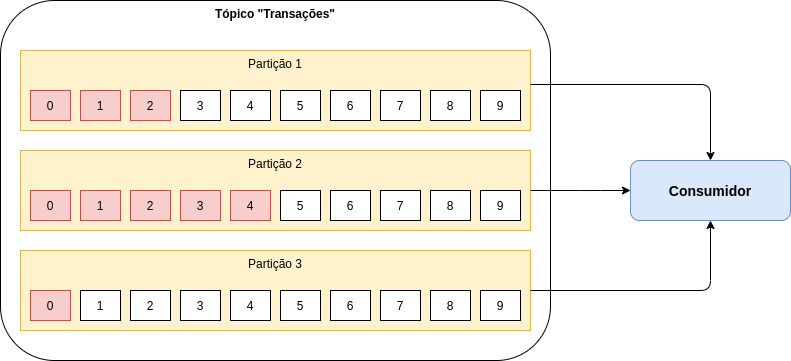

# Kafka - Consumidor

Na arquitetura do Apache Kafka existem vários componentes, como por exemplo, o **Consumidor** que tem a responsabilidade 
de processar os eventos de um determinado tópico.

O consumidor se escreve em um ou mais partições de um determinado tópico e processa os eventos conforme eles vão sendo 
gerados!

A cada processamento o consumidor tem a responsabilidade de gravar em qual ponto ele parou de ler e em qual partição, 
como por exemplo, na imagem abaixo:

Na imagem acima, sabemos que o consumidor consumiu as mensagens:

- 0, 1 e 2 da partição 1
- 0, 1, 2, 3 e 4 da partição 2
- 0 da partição 3

Assim caso o consumidor seja parado, por exemplo, para ser atualizado, ele sabe em que ponto ele parou de processar!

Um ponto bastante interessante é que se houver a necessidade de processar novamente os eventos, basta o consumidor zerar 
seu histórico de processamento ([offset](https://kafka.apache.org/documentation/#auto.offset.reset)), pois, o Apache 
Kafka armazena os eventos de cada partição de acordo com o configurado 1 dia, mês, ano, etc.

Para que isso seja possível o consumidor precisa configurar qual modelo ele quer fazer de coletar de eventos:

- latest: Processa a partir do último processado.
- earliest: Zera o offset e processa desde o inicio.
- none: Não processa nenhum evento e lança uma exceção em sua aplicação.

# Dicas de Luram Archanjo

Sempre quando utilizamos Apache Kafka temos que pensar em idempotência nos nossos consumidores, pois, pode ser que um dia 
seja utilizado a funcionalidade de processar todos os eventos! Portanto, tenha cuidado com o modelo de commit 
periódico ([Auto commit](https://kafka.apache.org/documentation/#enable.auto.commit)).

Se seu consumidor processou 10 eventos e por algum motivo caiu e não foi executado o commit periódico, ao subir novamente 
seu consumidor irá processar novamente os 10 eventos!

# Informações de suporte

Quer saber mais sobre Consumidor? Acesse o [link!](https://kafka.apache.org/)