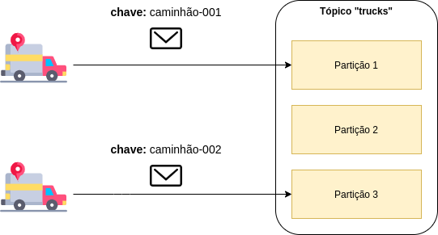

# Kafka - Partição

Na arquitetura do Apache Kafka existem vários componentes, como por exemplo, o Tópico que tem a responsabilidade de 
representar um stream de evento, como por exemplo, um tópico de transações!

O tópico é consistido por várias partições, de acordo com o configurado, como por exemplo, na imagem abaixo:

A partição é uma maneira de prover redundância e escalabilidade, pois, cada partição pode estar em um broker diferente, 
conforme imagem abaixo:

Demais né!?

Além dos pontos citados acima temos a possibilidade de segmentar os eventos de acordo com uma determinada chave!

Quando enviamos um evento sem chave, o tópico seleciona aleatoriamente a partição que irá o evento, porém quando enviamos 
com uma chave, todos os eventos com a mesma chave irá somente para aquela partição e de forma ordenada, conforme imagem 
abaixo:

Na imagem acima, imagina que temos um sistema de rastreamento de caminhões e gostaríamos de saber **cronologicamente** as 
posições do mesmo!?

Basta enviar os eventos de posição do GPS com o identificador do caminhão na chave, assim, temos **cronologicamente** todas 
as posições, como por exemplo:

1. São Paulo ~ 14:00
2. Rio de Janeiro ~ 15:30
3. Espirito Santos ~ 18:00

Imagina se a gente não envia-se o identificador com chave? Ficaria algo aleatorio, como por exemplo:

1. Espirito Santos ~ 18:00
2. Rio de Janeiro ~ 15:30
3. São Paulo ~ 14:00

Demais né! Uma simples funcionalidade com vários casos de uso!

# Informações de suporte

Quer saber mais sobre Tópico? Acesse o [link!](https://kafka.apache.org/)